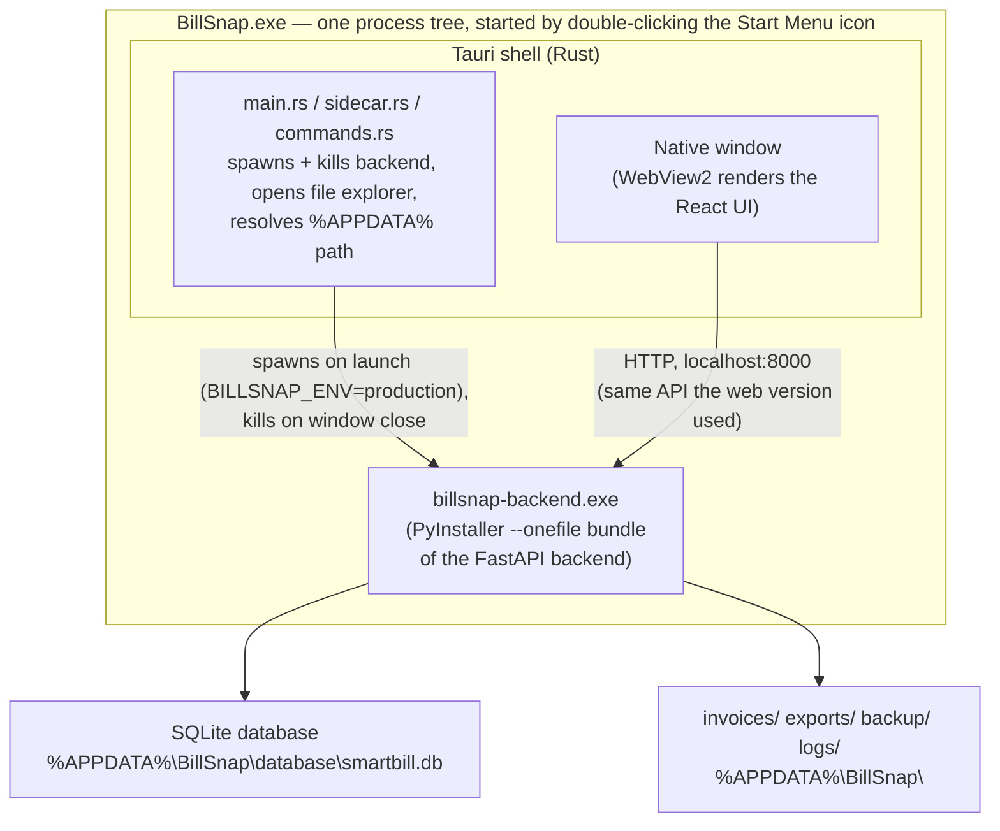

# BillSnap — Architecture

## System overview

## What changed vs. the original web app, and what didn't

| Layer | Status | Notes |
|---|---|---|
| React frontend (components, pages, stores, API calls) | **Unchanged** | Same code, same `localhost:8000` API calls. Built as static files instead of served by Vite's dev server. |
| FastAPI backend (routes, services, repositories, models) | **Unchanged** business logic | Same invoice/inventory/PDF/Excel/backup logic. Only the *file paths* it reads/writes changed (see below). |
| Where data lives | **Changed** | Was relative to the `backend/` project folder; now resolved through `app/core/paths.py` to `%APPDATA%\BillSnap\` (production) or `%APPDATA%\BillSnap-Dev\` (development) — see that file's docstring for the full reasoning. |
| Company seeding | **Changed** | The old version auto-created "Sharma Agency" and "Sharma Electricals" rows on first run. The desktop version creates zero companies on a fresh database; a first-run setup wizard (`CompanySetup.tsx`, gated by `CompanySetupGate.tsx`) prompts for the first company instead — necessary because each shop now gets its own separate install, so hardcoding either company into every install would be wrong for one of them. |
| How the backend starts | **Changed** | Was `uvicorn main:app --reload`, run manually in a terminal. Now: Tauri's Rust shell spawns a PyInstaller-packaged `billsnap-backend.exe` as a child process automatically when the app window opens, and kills it when the window closes. `main.py` gained a `__main__` block specifically to support being launched this way (see that file for why a console-app entry point and a `uvicorn` CLI–imported module need different startup paths). |
| Printing | **Unchanged in principle** | The existing iframe-based browser print flow is expected to keep working as-is inside Tauri's WebView2 (which is Chromium-based) — this should be verified once `cargo tauri dev` is actually run and tested with a real invoice print. |
| Window, icon, installer | **New** | None of this existed before; see Tauri's `src-tauri/` folder. |

## Process lifecycle

1. User double-clicks the BillSnap shortcut (Start Menu or Desktop).
2. Windows launches `billsnap.exe` (the Tauri-built app).
3. Tauri's Rust `setup()` hook (`main.rs`) immediately spawns
   `billsnap-backend.exe` as a child process with `BILLSNAP_ENV=production`
   set, and opens the main window.
4. The React UI loads and immediately starts polling `GET /health`
   (`BackendReadyGate.tsx`) every 400ms, showing a "Starting BillSnap..."
   state until it succeeds — covering the ~2-3 seconds the Python
   backend needs to import its dependencies and start listening.
5. Once healthy, `CompanySetupGate.tsx` checks whether any company
   exists yet. Fresh install → shows the setup wizard. Existing install
   → proceeds straight to the normal Dashboard/routes.
6. User closes the window → Tauri's `on_window_event` handler
   (`main.rs`) calls `sidecar::kill_backend()`, terminating the Python
   process. Nothing is left running in the background.

## Why this architecture (Tauri + sidecar) over the alternatives

See the original migration conversation for the full comparison against
Electron, PySide/Qt, and .NET MAUI. Summary of the decision: Tauri lets
the existing React frontend and FastAPI backend be reused almost
entirely unchanged, produces a much smaller installer than Electron
(no bundled Chromium — relies on Windows' built-in WebView2), and the
two shop PCs are confirmed to be on modern Windows 10/11 where WebView2
is already present, removing the main risk factor that would have
favored Electron instead.

## Known limitation worth tracking

The Python backend is packaged with PyInstaller's `--onefile` mode,
which self-extracts to a temporary folder on every launch. This was a
deliberate choice over `--onedir` specifically because Tauri's sidecar
mechanism (`externalBin`) only manages a single named executable file,
not a folder of supporting files alongside it — `--onedir`'s output
doesn't fit that contract without extra, fragile workarounds. The
tradeoff is a small, fixed startup cost on every launch (already
absorbed by the loading state in step 4 above), not a one-time cost.
