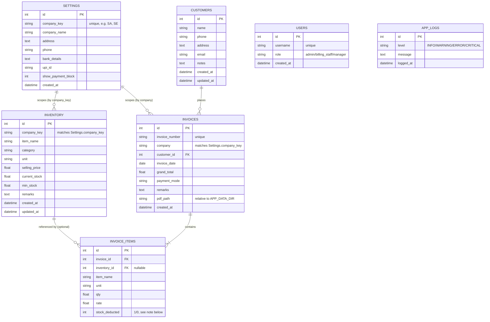

# BillSnap — Database Schema

BillSnap uses a single SQLite file (`smartbill.db`), located at
`%APPDATA%\BillSnap\database\smartbill.db` in the packaged desktop app
(see `backend/app/core/paths.py`). There is no separate database server
to install or manage.

## Entity-relationship diagram

## Key design points

**No hardcoded companies.** `SETTINGS` is effectively the "Companies"
table — every company (Sharma Agency, Sharma Electricals, or any future
one) is just a row here, created at runtime via Settings → Companies or
the first-run setup wizard. Nothing in the schema or code hardcodes a
specific `company_key`. `INVENTORY.company_key` and
`INVOICES.company` are plain string columns validated against
`SETTINGS.company_key` at the API layer (see `app/api/inventory.py`'s
`_validate_company`), not enforced via a database foreign key — this
was a deliberate choice already present in the codebase before this
migration, keeping company management simple (no schema migration
needed to add a company).

**`InvoiceItem.stock_deducted`.** Tracks whether a line item's quantity
was actually subtracted from a matching `Inventory` row when the
invoice was saved. This matters for editing: if you edit an invoice and
change a quantity, the system needs to know which lines to add stock
back to before applying the new quantities — without this flag, that
reversal would be ambiguous for items that were free-typed (not matched
to an existing inventory item) versus genuinely stocked items.

**`Invoice.pdf_path` is relative, not absolute.** It's stored as a path
relative to `APP_DATA_DIR` (e.g. `invoices/2026/June/SA-...-001.pdf`),
then resolved to an absolute path at read-time by joining it with
`APP_DATA_DIR` — see `app/api/invoice.py`. This was true before the
desktop migration too; what changed is *what* `APP_DATA_DIR` points to
(see `app/core/paths.py`), not the relative-path design itself.

**No bool type.** SQLite has no native boolean — `show_payment_block`
and `stock_deducted` are stored as `Integer` (1/0), a SQLite-specific
convention already used throughout the existing schema.

## Migrations

SQLite has no built-in schema migration tool. BillSnap handles this with
a small hand-rolled runner in `app/database/db.py`
(`_run_column_migrations`): a list of `(table, column, type)` tuples
that get `ALTER TABLE ... ADD COLUMN`-ed in if missing, on every
startup. This is intentionally simple — adequate for a single-file
SQLite app with a small, slowly-changing schema — rather than pulling in
a full migration framework like Alembic, which would be disproportionate
overhead for this project's size.

If you ever add a new column to an existing table, add an entry to
`_COLUMN_MIGRATIONS` in `db.py` rather than relying on
`Base.metadata.create_all()` alone — `create_all()` only creates
missing *tables*, never adds columns to ones that already exist, so
anyone with an existing database file would otherwise get a startup
crash ("no such column") the next time they open the app after an
update.
